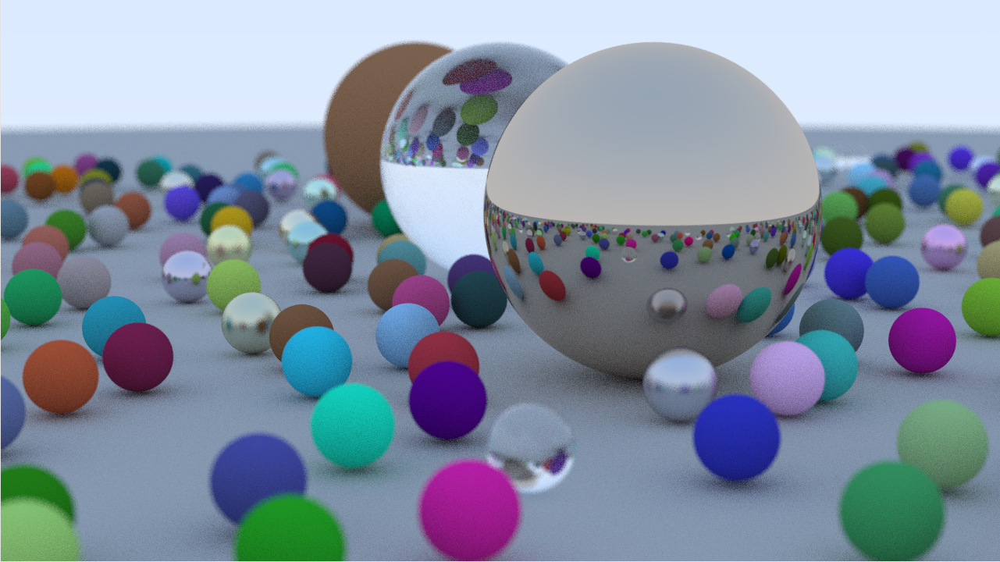
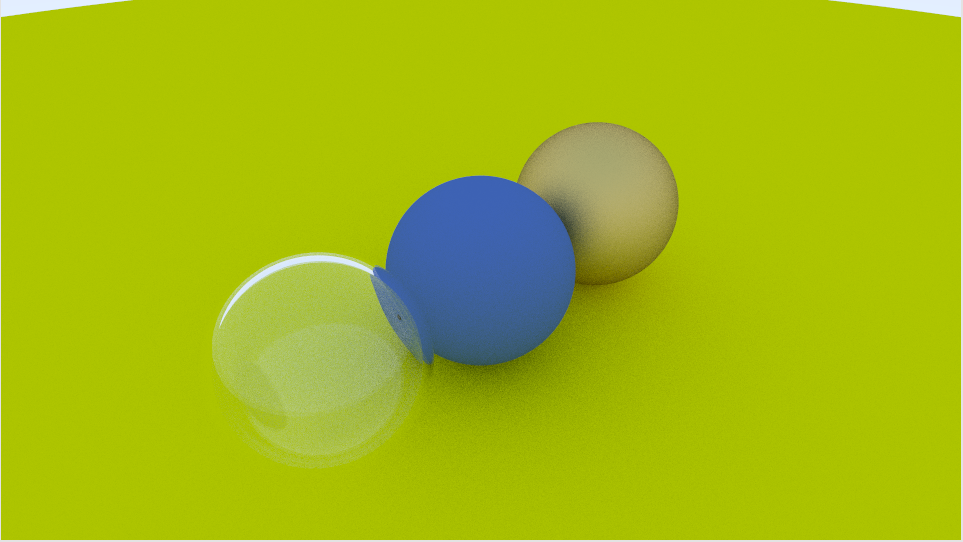

# raytracer
Experimenting with creating a CPU raytracer. Main resource is [_Ray Tracing in One Weekend_](https://raytracing.github.io/books/RayTracingInOneWeekend.html)

Currently renders only spheres. Has three material types: diffuse, metallic, dielectric.

*Showcase of the current version of the renderer, implements all of "Raytracing in one weekend"'s core functions + multi-threading*

*Earlier version with glass, metallic, and diffuse balls. Notice how the glass ball is hollow?*

# Dependencies
- [raylib](https://github.com/raysan5/raylib) for drawing and Vector3 class library
