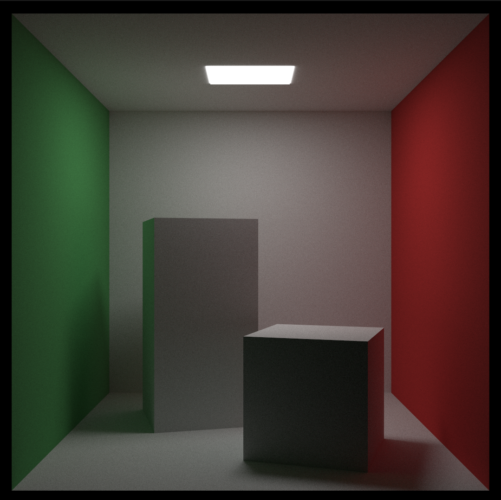
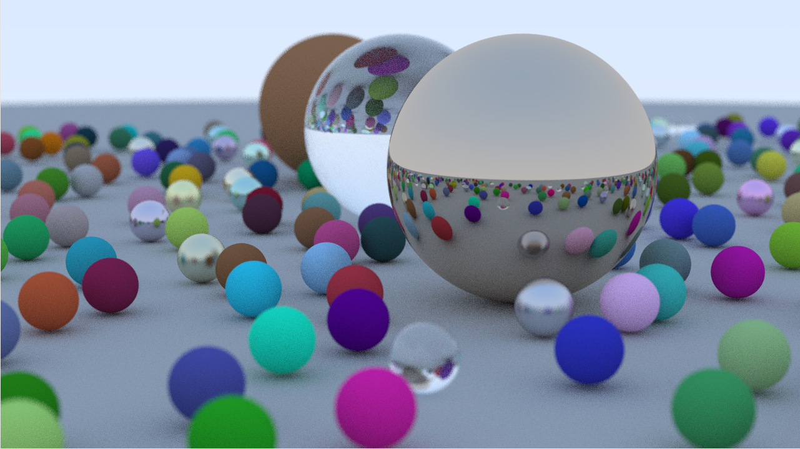
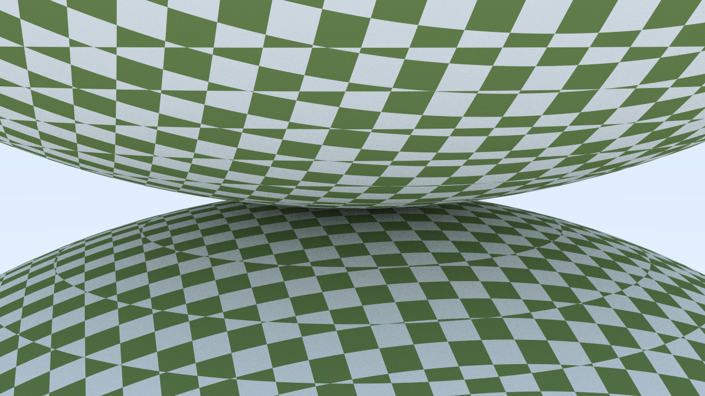
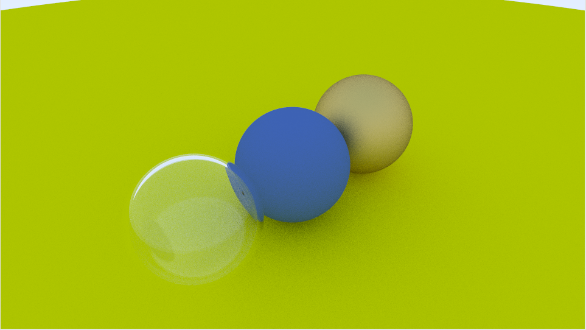

# raytracer
Experimenting with creating a CPU raytracer. Main resources:
- [_Ray Tracing in One Weekend_](https://raytracing.github.io/books/RayTracingInOneWeekend.html)
- [_Ray Tracing: The Next Week_](https://raytracing.github.io/books/RayTracingTheNextWeek.html)

# Showcase

*Cornell box. This version added support for quads, boxes, lights, textures, and more! Rendered with 10k samples and 50 bounces*

*Showcase of an earlier version of the renderer, implements all of "Raytracing in one weekend"'s core functions + multi-threading*

*Texture mapping for spheres!*

  
*Earlier version with glass, metallic, and diffuse balls. Notice how the glass ball is hollow?*

# Features
- Currently renders only spheres (more to come).
- Three material types: diffuse, metallic, dielectric. 
- Supports spatial acceleration with BVHs.
- Texture mapping.

# Dependencies
- [raylib](https://github.com/raysan5/raylib) for drawing and Vector3 class library
- [glm](https://github.com/g-truc/glm) for transforms
- [rlImGui](https://github.com/raylib-extras/rlImGui) for imgui support
- [nlohmann-json](https://github.com/nlohmann/json) for json support
